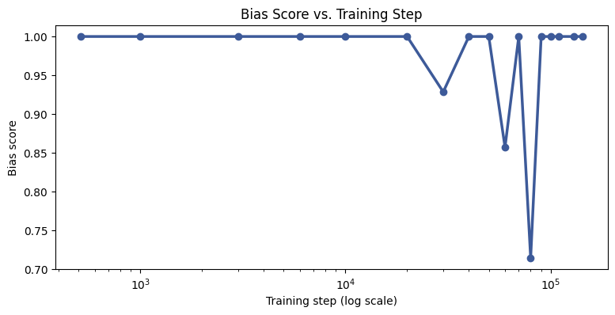
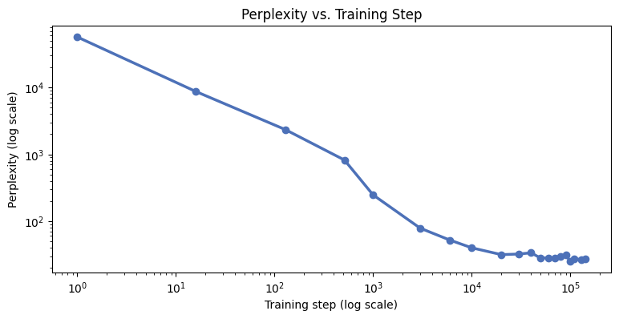
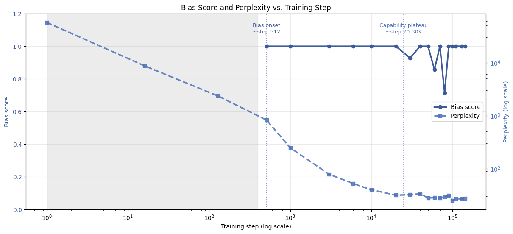

# Judge Bias Across Training Checkpoints

Measures when position bias emerges in LLM-as-judge evaluation across 20 Pythia-1.4B training checkpoints, and whether it tracks general capability (perplexity) or develops independently.

## Method

At each checkpoint, the model judges 15 quality-matched response pairs--which are paraphrased versions of each other so there is no objective quality difference--in both orders (e.g., normal and swapped). This means that if a response follows the slot instead of the content, on the same pair in both orders, it'll fairly be counted as position bias. Perplexity on five fixed held-out sentences is computed at the same checkpoints as a capability proxy.

Additionally, note base Pythia checkpoints aren't instruction-tuned, so the judge prompt uses three few-shot examples with randomized verdicts, to teach output format without teaching a spurious answer pattern.

## Results

Please reference: 

Position bias emerges around step 512, however, perplexity plateaus around step 20,000-30,000. Bias onset happens early in training, while general capability is still improving. In other words, the two are separable behavior.

## Running it

Open `judge_bias_checkpoints.ipynb` in Colab. Pythia is a public model, so no Hugging Face token or login is needed. The notebook saves progress to `results.json` and `perplexity_results.json` after each checkpoint, so an interrupted run picks back up instead of restarting.
